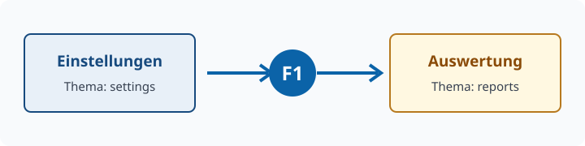

# settings | Settings

## What is this page for? {#overview}

Use this tab to change the sample's **personal settings**.
The display name is only an example; the *color scheme* demonstrates a typical selection field.

> [!TIP]
> Press `F1` at any time to open help for the currently active tab.

## Fields

| Field | Meaning | Example |
|-------|---------|---------|
| Display name | Name used by the user interface | `Sample user` |
| Color scheme | Visual appearance of the application | System setting |

Color scheme
:   Determines whether the application uses a light theme, a dark theme, or the current Windows setting.

## Recommended steps

1. Enter a display name.
2. Select the desired color scheme.
3. Switch to the **Report** tab.

Continue with [creating a report](topic:reports).

!include ../Shared/Keyboard.md
